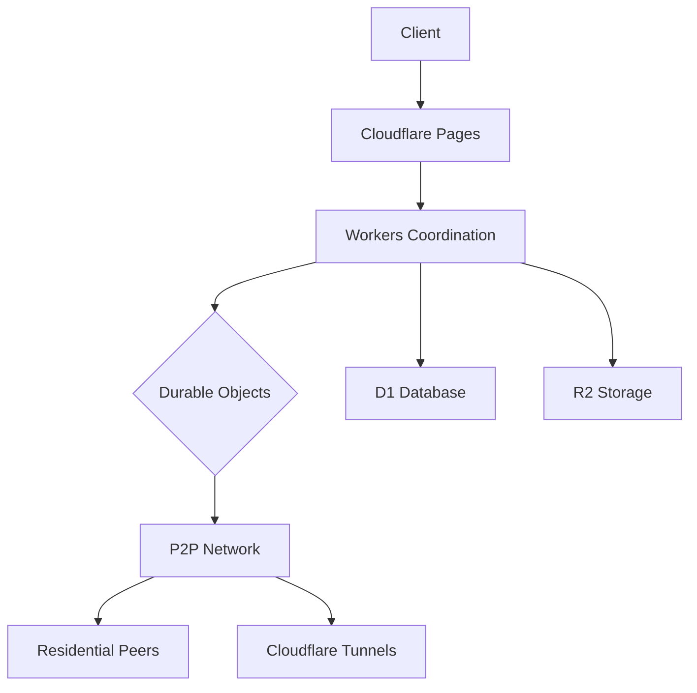

# Cloudflare-Centric Hybrid Media Server Implementation Strategy

  

## Architectural Revisions for Cloudflare Integration

  

### Core Cloudflare Services Utilization

The revised architecture leverages Cloudflare's developer platform while maintaining hybrid P2P capabilities:

  

**1. Cloudflare Workers Coordination Layer**

- Replace custom Go coordination service with Workers handling:

- Authentication via Cloudflare Access with WebAuthn integration[4][5]

- Peer discovery using Durable Objects for real-time synchronization[4]

- Metadata storage in D1 SQL database with automatic cleanup[4]

  

**2. Cloudflare Tunnel P2P Networking**

- Implement secure peer connections using:

- `cloudflared` tunnels for NAT traversal[2][3]

- WebRTC Streams for browser-to-browser media delivery[5]

- Magic Transit for IP-layer security (enterprise feature)

  

**3. Cloudflare R2 Media Storage**

- Hybrid storage architecture:

- Hot cache in R2 object storage (S3-compatible)[5]

- Cold storage in peer nodes with R2 replication triggers

- Automatic tiering based on access patterns

  



  

## Modified Implementation Roadmap

  

### Phase 1: Cloudflare Foundation (Weeks 1-4)

1. **Core Infrastructure**

- Configure Cloudflare Zero Trust policies for user access

- Deploy D1 database schema for media metadata[4]

- Implement R2 lifecycle rules for automatic tiering

  

2. **Authentication System**

```typescript

// workers-auth.js

export default {

async fetch(request, env) {

const { authenticator } = await import('@cf/web-authn');

const challenge = crypto.randomUUID();

await env.D1.prepare(

'INSERT INTO challenges (id, expires) VALUES (?1, ?2)'

).bind(challenge, Date.now() + 300000).run();

return authenticator.generateRegistrationOptions({

challenge,

rpName: 'ManofWar Media'

});

}

}

```

*WebAuthn implementation using D1 for challenge storage[4]*

  

### Phase 2: P2P Integration (Weeks 5-8)

1. **Tunnel Configuration**

```bash

# Peer deployment script

cloudflared tunnel create media-peer-$ID

cloudflared tunnel route dns media-peer-$ID media.example.com

cloudflared tunnel run --url http://localhost:3000

```

  

2. **Hybrid Streaming Logic**

- Prioritized delivery path:

1. Local network peers (LAN discovery)

2. Cloudflare-optimized peers (Anycast routing)

3. R2 fallback with on-demand transcoding

  

### Phase 3: Optimization (Weeks 9-12)

4. **Performance Enhancements**

- Cache warming using Cloudflare Cache Reserve

- Regional sharding with Durable Objects[4]

- Bandwidth Alliance partner peering

  

## AI Development Prompts

  

**1. Zero Trust Configuration**

```

Create a Cloudflare Worker implementing device posture checks with:

- WebAuthn authentication

- Client certificate validation

- Geolocation-based access rules

- Automated D1 session logging

```

  

**2. Media Synchronization Worker**

```

Develop a TypeScript Worker that:

5. Listens for R2 upload events

6. Generates HLS manifests using ffmpeg.wasm

7. Updates D1 media catalog

8. Triggers P2P cache seeding

9. Implements Cache API fallback

```

  

**3. Analytics Pipeline**

```

Build a Cloudflare Analytics integration tracking:

- Playback success rates per codec

- P2P bandwidth savings

- Regional performance metrics

- Anomaly detection via AI Analytics

```

  

## Research Sources

  

10. **Core Documentation**

- [ManofWar README.md][1]

- [Cloudflare Developer Portal][2][3]

- [WebAuthn Challenge Storage Best Practices][4]

- [Workers KV Architectural Patterns][5]

  

11. **Community Resources**

- Cloudflare Developers Subreddit Threads[4][5]

- Workers Unbound Case Studies[5]

- Magic Transit Deployment Guides[3]

  

12. **Complementary Technologies**

- WebCodecs API Specification

- WebTransport Draft Standard

- libp2p NAT Traversal Protocols

  

## Cost Optimization Strategy

  

| Component | Cloudflare Plan | Monthly Estimate |

|-------------------|-----------------|------------------|

| Workers | Unbound | $0.15/M req |

| R2 Storage | Business | $0.015/GB |

| D1 Database | Pro | $0.20/GB-mo |

| Durable Objects | Enterprise | $0.02/GB-hr |

| Streaming | Stream Delivery | $1.00/1000 min |

  

*Enterprise features require direct Cloudflare partnership negotiation*

  

## Security Implementation Checklist

  

13. **Data Protection**

- R2 Server-Side Encryption with Key Management

- D1 Field-Level Encryption via Workers

- TLS 1.3 for All Peer Connections

  

14. **Access Controls**

- Time-of-Day Access Restrictions

- Device Attestation Requirements

- Session Binding to IP/Cookie Pair

  

15. **Compliance**

- GDPR Data Processing Agreement

- CCPA Opt-Out Mechanisms

- FedRAMP Moderate Alignment

  

## Final Architecture Recommendations

  

16. **Core Cloudflare Services**

- Use Workers for all coordination logic

- Implement D1 for relational data needs

- Leverage R2 as primary media cache

  

17. **P2P Enhancements**

- Maintain lightweight libp2p implementation

- Use Tunnels for guaranteed connectivity

- Implement hybrid WebRTC/HTTP delivery

  

18. **Fallback Strategies**

- Local SQLite cache for offline peers

- Automatic VPS failover using Terraform

- Cross-cloud replication to Backblaze B2

  

*Implementation guides and Worker templates available at manofwar.dev/cloudflare-docs*

[1] Project README.md [2] developers.cloudflare.com [3] Cloudflare Tunnel Documentation [4] Reddit WebAuthn Challenge Discussion [5] Cloudflare Workers ELI5 Thread

  

Citations:

[1] https://ppl-ai-file-upload.s3.amazonaws.com/web/direct-files/45207093/23722263-a218-4cc0-92ca-4940ff324584/README.md

[2] https://developers.cloudflare.com

[3] https://developers.cloudflare.com

[4] https://www.reddit.com/r/CloudFlare/comments/15sta7g/what_is_the_best_way_to_store_a_webauthn/

[5] https://www.reddit.com/r/CloudFlare/comments/g7l8xj/eli5_cloudflare_workers/

[6] https://www.reddit.com/r/CloudFlare/comments/16a9bjj/cloudflare_pages_external_dns/

[7] https://www.reddit.com/r/CloudFlare/comments/1i4ki7g/is_there_a_way_to_verify_that_the_connection/

[8] https://www.reddit.com/r/CloudFlare/comments/piektz/which_database_for_workers/

[9] https://www.reddit.com/r/serverless/comments/o0w2q7/redis_at_the_edge_with_cloudflare_workers/

[10] https://www.reddit.com/r/CloudFlare/comments/1c26r8z/how_to_get_cloudflare_to_host_github_pages_using/

[11] https://www.reddit.com/r/CloudFlare/comments/15lmwfh/cloudflare_tunnel_to_self_signed_cert/

[12] https://www.reddit.com/r/CloudFlare/comments/vbyqo1/is_it_possible_to_use_r2_to_host_static_assets/

[13] https://www.reddit.com/r/aws/comments/wjol2j/is_cloudflare_r2_the_best_service_to_use_for/

[14] https://www.reddit.com/r/unRAID/comments/1h30rsp/server_architecture_setup/

[15] https://www.reddit.com/r/CloudFlare/comments/1fhgj1z/r2_bucket_binding_not_found_in_worker_despite/

[16] https://www.reddit.com/r/CloudFlare/comments/1bgrp7y/integrating_cloudflare_r2_with_serverless/

[17] https://www.reddit.com/r/CloudFlare/comments/1ic51x1/r2_pricing_serving_filesimages_is_not_free/

[18] https://www.reddit.com/r/unRAID/comments/1i251of/media_server_help_cloudflare_tunnel/

[19] https://www.reddit.com/r/CloudFlare/comments/g7l8xj/eli5_cloudflare_workers/

[20] https://www.reddit.com/r/elixir/comments/1bmy0lo/elixir_vs_cloudflare_workers_paradigm/

[21] https://www.reddit.com/r/node/comments/15qo28j/can_anyone_say_me_some_pro_and_cons_of_cloudflare/

[22] https://www.reddit.com/r/CloudFlare/comments/1hvzxk2/custom_domains_on_cloudflare_pages/

[23] https://www.reddit.com/r/selfhosted/comments/1ainaxc/secure_cloudflare_tunnels/

[24] https://www.reddit.com/r/CloudFlare/comments/1da8mkf/cloudflare_pages_d1_advice/

[25] https://www.reddit.com/r/astrojs/comments/1b6flpp/confused_about_astro_cloudflare_workers/

[26] https://www.reddit.com/r/CloudFlare/comments/1iiz9i8/can_i_really_host_up_to_100_domains_static_sites/

[27] https://www.reddit.com/r/selfhosted/comments/15kvhla/how_to_reverse_proxy_w_ssl_on_lan_while_using/

[28] https://www.reddit.com/r/Deno/comments/17x2npj/vercelnextjs_versus_deployfresh_versus_cloudflare/

[29] https://www.reddit.com/r/devops/comments/18wxumv/how_is_cloudflare_making_any_money/

[30] https://www.reddit.com/r/CloudFlare/comments/zirb98/if_i_host_my_website_on_cloudflare_pages_and/

[31] https://www.reddit.com/r/selfhosted/comments/zjph76/cloudflare_tunnel_does_cloudflare_analyse_the/

[32] https://www.cloudflare.com/developer-platform/products/durable-objects/

[33] https://developers.cloudflare.com/kv/get-started/

[34] https://developers.cloudflare.com/pages/configuration/custom-domains/

[35] https://developers.cloudflare.com/learning-paths/get-started/security/secure-origin/

[36] https://developers.cloudflare.com/durable-objects/examples/use-kv-from-durable-objects/

[37] https://developers.cloudflare.com/kv/concepts/kv-bindings/

[38] https://developers.cloudflare.com/pages/how-to/custom-branch-aliases/

[39] https://www.vaadata.com/blog/cloudflare-how-to-secure-your-origin-server/

[40] https://developers.cloudflare.com/durable-objects/get-started/tutorial/

[41] https://www.cloudflare.com/developer-platform/products/workers-kv/

[42] https://community.cloudflare.com/t/i-need-to-know-the-real-deal-on-pages-and-using-a-domain-with-external-dns-registrar/610194

[43] https://community.cloudflare.com/t/locking-down-the-origin-server/447946

[44] https://developers.cloudflare.com/browser-rendering/get-started/browser-rendering-with-do/

[45] https://blog.cloudflare.com/workers-kv-is-ga/

[46] https://community.cloudflare.com/t/how-to-set-page-domain-step-by-step/604052

[47] https://developers.cloudflare.com/cloudflare-one/connections/connect-networks/

[48] https://tinybase.org/guides/integrations/cloudflare-durable-objects/

[49] https://developers.cloudflare.com/kv/

[50] https://pages.cloudflare.com

[51] https://developers.cloudflare.com/cloudflare-one/connections/connect-networks/configure-tunnels/origin-configuration/

[52] https://www.reddit.com/r/CloudFlare/comments/16bl1ex/anyone_here_that_usesused_cloudflare_stream_on_a/

[53] https://www.reddit.com/r/nextjs/comments/1c3nrs4/how_to_use_cloudflare_r2_storage_when_the_site_is/

[54] https://www.reddit.com/r/selfhosted/comments/pvseqd/homelab_hardening_idea_accessing_home_server/

[55] https://www.reddit.com/r/selfhosted/comments/192p6pv/i_wrote_a_guide_on_how_to_use_plex_media_server/

[56] https://www.reddit.com/r/CloudFlare/comments/yfztrg/how_to_host_game_servers_with_cloud_flare/

[57] https://www.reddit.com/r/CloudFlare/comments/1fabijw/cloudflare_r2/

[58] https://www.reddit.com/r/selfhosted/comments/133rr6n/about_cloudflare_tunnels/

[59] https://www.reddit.com/r/PleX/comments/192jrf2/i_wrote_a_guide_on_how_to_use_plex_media_server/

[60] https://www.reddit.com/r/rails/comments/108domy/setting_up_activestorage_with_cloudflare_r2/

[61] https://www.reddit.com/r/Mastodon/comments/yzod0q/i_finally_figured_out_how_to_use_cloudflare_r2/

[62] https://www.reddit.com/r/selfhosted/comments/1cnauhd/cloudflare_tunnels_vs_tailscale_from_a/

[63] https://www.reddit.com/r/selfhosted/comments/1epf6vg/i_built_a_free_code_to_mirror_any_website_using/

[64] https://docs.imgix.com/en-US/getting-started/setup/creating-sources/cloudflare-r2

[65] https://developers.cloudflare.com/pages/tutorials/use-r2-as-static-asset-storage-for-pages/

[66] https://www.infoq.com/presentations/video-infrastructure-cloudflare/

[67] https://developers.cloudflare.com/learning-paths/workers/concepts/workers-concepts/

[68] https://themedev.net/blog/how-to-offload-wp-media-to-cloudflare-r2/

[69] https://developers.cloudflare.com/reference-architecture/architectures/cdn/

[70] https://www.cloudflare.com/developer-platform/products/cloudflare-stream/

[71] https://www.files.com/integrations/cloudflare

[72] https://developers.cloudflare.com/r2/buckets/storage-classes/

[73] https://blog.cloudflare.com/sv-se/behind-the-scenes-with-stream-live-cloudflares-live-streaming-service/

[74] https://workers.cloudflare.com/built-with/projects/Curios

[75] https://www.youtube.com/watch?v=GDL2bzYMgLY

[76] https://developers.cloudflare.com/r2/get-started/

[77] https://www.cloudflare.com/media-and-entertainment/

[78] https://workers.cloudflare.com/built-with/projects/Microfeed

[79] https://jackwhitworth.com/blog/cloudflare-r2-buckets-with-wordpress/

[80] https://developers.cloudflare.com/r2/pricing/

[81] https://www.cloudflare.com/architecture/

[82] https://workers.cloudflare.com/built-with/collections/media